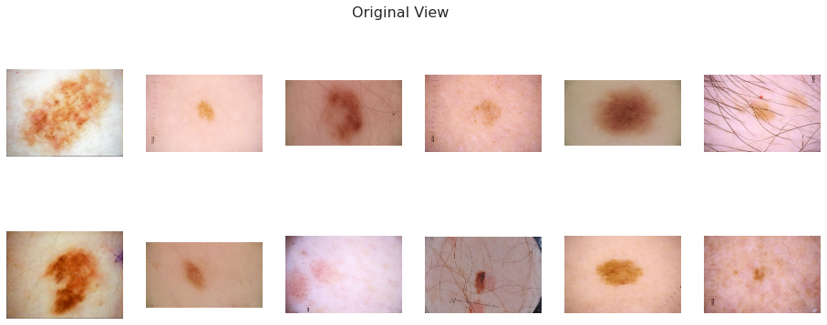
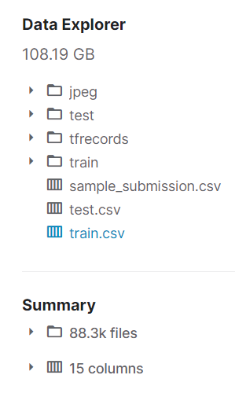
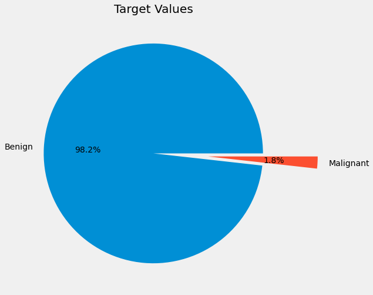
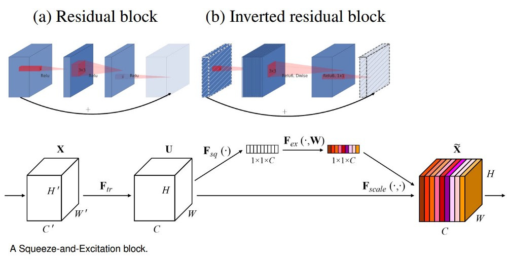

# Detecting Melanoma Cancer using Deep Learning

The code in this repository was originally my submission and EDA notebook for [SIIM-ISIC Melanoma Classification Challenge on Kaggle](https://www.kaggle.com/c/siim-isic-melanoma-classification).

You can see my original [notebook here](https://www.kaggle.com/heyytanay/siim-isic-all-you-need-to-get-started/#data).

## The Challenge

Melanoma is a deadly disease, but if caught early, most melanomas can be cured with minor surgery. Image analysis tools that automate the diagnosis of melanoma will improve dermatologists' diagnostic accuracy. Better detection of melanoma has the opportunity to positively impact millions of people.

In this competition, we’ll identify melanoma in images of skin lesions. In particular, we’ll use images within the same patient and determine which are likely to represent a melanoma. Using patient-level contextual information may help the development of image analysis tools, which could better support clinical dermatologists.

## The Data

The images are provided in DICOM format. This can be accessed using commonly-available libraries like pydicom, and contains both image and metadata. It is a commonly used medical imaging data format.

Images are also provided in JPEG and TFRecord format (in the jpeg and tfrecords directories, respectively). Images in TFRecord format have been resized to a uniform 1024x1024.

Metadata is also provided outside of the DICOM format, in CSV files

## The Target
We are predicting a binary target for each image. The model should predict the probability (floating point) between 0.0 and 1.0 that the lesion in the image is malignant (the target). In the training data, train.csv, the value 0 denotes benign, and 1 indicates malignant.

## The Approach

Since the data imbalance is very high in the original dataset, I am using a different external dataset (openly available on Kaggle and follows competetion rules.). The external data has more images for malignant category along with all the images resized to `256 * 256` dimensions, since the original images were differently sized.

Due to data imbalance, I have used `GroupFolds` for spliting the data into 5-different folds of training and testing set so that the amount of the data imbalance is reduced during training of each fold.

Apart from Basic Transformations and Data Classes, I have made a Network Class that has the neural net responsible for training. 

It can be trained using either ResNet or EfficientNet for the time being. Currently, it just uses the image as a feature to train the model, but I am planning on doing `Feature Concatenation` to join image feature with other meta-features such as `Age` and `Sex`.

I have provided the trained weights of the best model (till now) [here](exports\best_model.pth).

## Results - Under Work

Currently, the model achieves a final **Validation Accuracy** of `~78%`.

Which puts me in top-80% on the global leaderboard, which I intend to improve.

### Links:
- [My Kaggle Notebook](www.kaggle.com/heyytanay/siim-isic-all-you-need-to-get-started/)
- [SIIM-ISIC Melanoma Classification](https://www.kaggle.com/c/siim-isic-melanoma-classification)